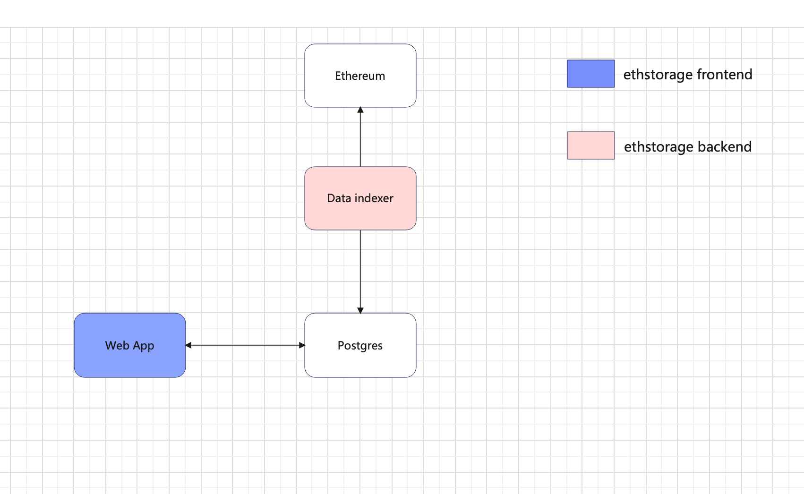

# ethstorage_browser


# 代码库概述

### ethstorage_browser 由以下主要部分组成：

1. Web 应用：托管在 Vercel 上的Next.js应用程序，用于启动通过 Prisma 与数据库通信的 tRPC API。它还使用 Tailwind CSS 进行样式设置。

2.  数据 indexer: 一种 Node 服务，它定时监听以太坊区块链RPC，查找包含 EthStorage 的交易，并将它们存储到 Postgress 进行索引。


# 本地运行

### 要求
1. Node.js 18+
2. pnpm

### 安装依赖项

安装最新的 Node.js 版本和 pnpm：

```
curl -fsSL https://deb.nodesource.com/setup_20.x | sudo -E bash -
sudo apt-get install -y nodejs
curl -fsSL https://get.pnpm.io/install.sh | sh -
```

### Git 克隆存储库：

```
git clone https://github.com/panyongxu1002/ethstorage_browser
cd ethstorage_browser
```

### 安装所有Node.js依赖项并运行：

```
pnpm i
pnpm dev
```